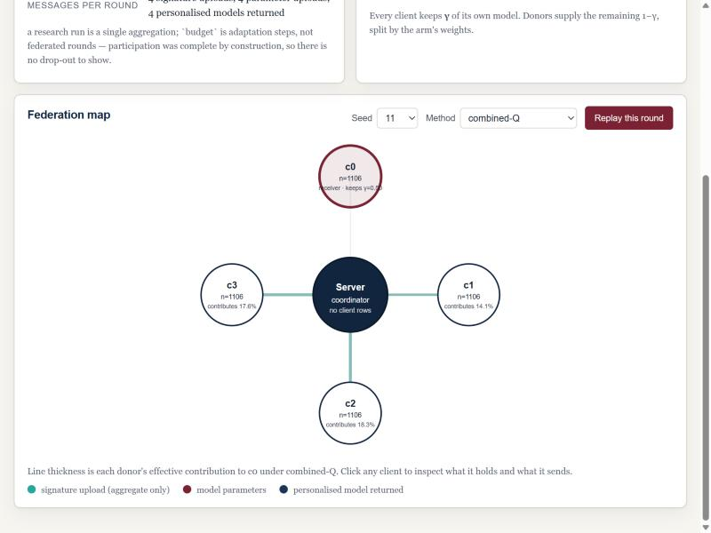
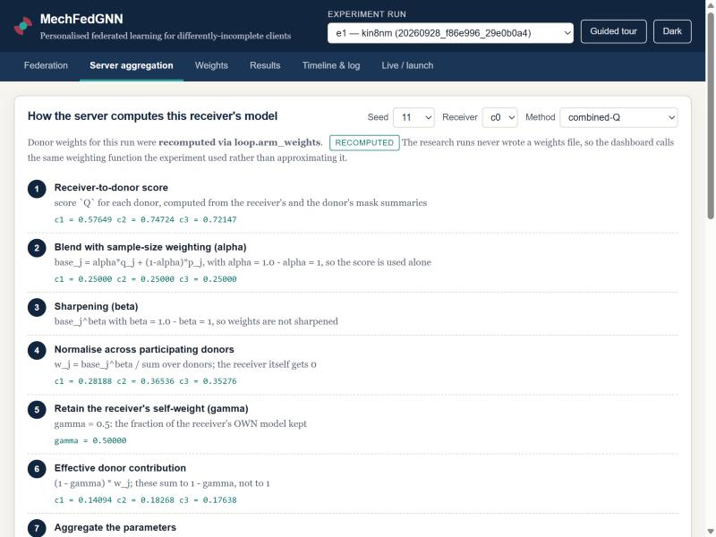
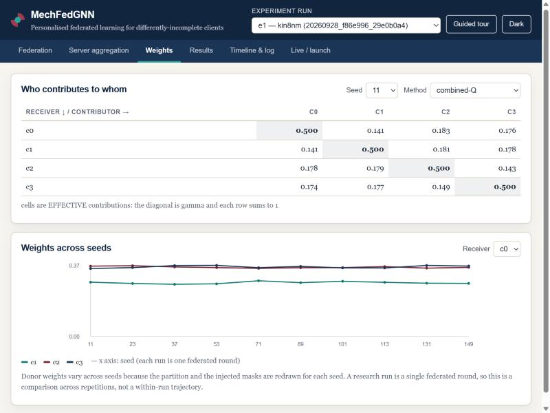
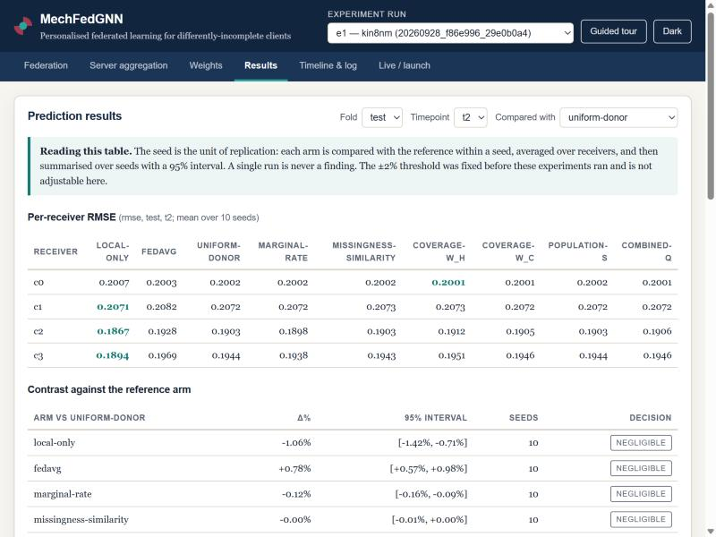
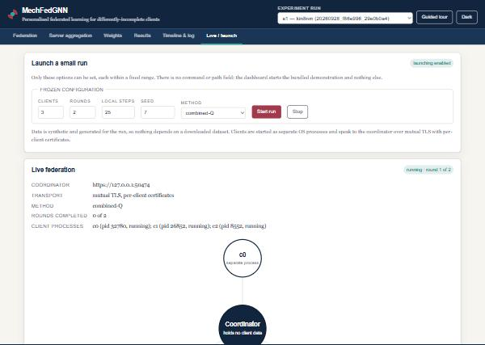

# Experiment dashboard

An interactive view of how MechFedGNN clients train, how the server turns their
aggregate summaries into donor weights, and how prediction results are produced.
It is a **presentation layer over the existing framework** — it trains nothing,
scores nothing and computes no statistics of its own.

---

## 1. Running it

```bash
python -m dashboard.app
```

Then open <http://127.0.0.1:8765>.

| Flag | Default | Meaning |
|---|---|---|
| `--host` | `127.0.0.1` | bind address. Localhost by default and deliberately so — the dashboard has **no authentication** |
| `--port` | `8765` | |
| `--results` | `results` | directory of completed runs to offer for replay |
| `--allow-launch` | off | enables the launch controls. Without it, launching returns 403 |

To include the launch controls:

```bash
python -m dashboard.app --allow-launch
```

Nothing needs to be downloaded: replay reads whatever is already under
`results/`, and a launched run generates its own synthetic shards.

---

## 2. What each screen shows

| Tab | Purpose |
|---|---|
| **Federation** | The clients, the coordinator, and this round's method. Line thickness is the donor's effective contribution to the selected receiver. Clicking a client shows its per-feature missingness and, explicitly, what it transmits |
| **Server aggregation** | The whole weighting calculation in seven steps with this run's actual numbers, ending in a balance line showing γ + Σ donor contributions = 1. A glossary defines every term used |
| **Weights** | The receiver × contributor matrix (diagonal = self-weight, rows sum to 1) and how weights vary across seeds |
| **Results** | Per-receiver RMSE, and each arm contrasted against a reference arm with a 95% interval and the pre-declared ±2% decision. Plus "How was this result computed?" for one receiver and arm |
| **Timeline & log** | The protocol's fixed order, with an explicit statement that historical runs recorded no timestamps, and a replay that steps through it |
| **Live / launch** | Monitoring of a running federation and the frozen launch controls |

A **guided tour** button walks through these in the order a demonstration wants
them, ending on the honest result rather than on the mechanism.

---

## 3. Where every number comes from

| Shown | Source |
|---|---|
| Client signatures, missing rates, histograms | `params/<client>.json` in the run directory |
| Scores | `scores.csv` |
| **Donor weights, γ, fallback reason** | **recomputed** by calling `loop.arm_weights` — see §4 |
| RMSE / MAE / AUC | `metrics.csv` |
| Δ% and its interval | `stats.seed_interval` and `stats.decide`, the experiments' own functions |
| Live weights | the real `ServerCoordinator.close_round` record |
| Live scores | `loop.pair_scores` on the aggregate signatures clients actually sent |

The browser formats these. It contains no scoring, weighting, aggregation or
statistics code.

---

## 4. Why weights are recomputed, and how that is checked

`report.write_run` — the function every research run used — saves
`metrics`, `scores`, `candidates`, `compute`, `geometry` and `function`. It
never wrote a weights file. (`runner.execute`, added during the framework
refactor, does write `weights.csv`, but no research run used it.)

So the dashboard recomputes realised weights by calling `loop.arm_weights`, the
same function `run_seed` called, with the saved scores and the saved `n_train`
values. Two tests hold that honest:

* `test_recomputed_weights_match_the_golden_reference` — the recomputed weights
  equal the weights captured from the **original** implementation in
  `tests/golden/reference.json`;
* `test_the_only_difference_is_the_artifacts_10_significant_digits` — fed
  full-precision scores, the same reader reproduces the realised weights
  **exactly**.

`scores.csv` is written with `float_format="%.10g"`, so a weight recomputed from
the file agrees to about 1e-10 relative. The second test is what establishes
that this rounding is the *only* difference, rather than a tolerance chosen to
make a comparison pass. The UI labels these weights "recomputed".

---

## 5. What is not available, and is said so

These are surfaced in the UI as `unavailable` rather than approximated.

| Missing | Why |
|---|---|
| **Event log for historical runs** | research runs recorded no events and no timestamps. The timeline is the protocol's fixed order and says so; the replay is labelled a reconstruction |
| **Squared-error sum and evaluated-record count** | `metrics.csv` saved the final RMSE only, so the RMSE formula cannot be shown with real sum/count |
| **Training loss curves** | `compute.csv` has steps, examples and seconds — not per-step loss |
| **Validation/test row counts** | only `n_train` per client was saved |
| **Multiple federated rounds in a research run** | a research run is a single aggregation; `budget` values are *local adaptation* steps, not rounds. Multi-round data exists only on the live path |
| **Per-step loss on the live path** | clients report a model update and aggregate error, not a loss curve |
| **Confirmed receipt of a delivered model** | no message in this protocol acknowledges a parent fetch, so "the client has it" is never claimed - only "requested" and "response sent" are observed |
| **Per-seed client sizes** | saved for the first seed only; the inspector flags the arms where that actually changes a weight |

---

## 6. Live monitoring

A launched run is the real system, not a simulation:

* the coordinator is the framework's `ServerCoordinator` behind its `ServerApp`;
* each client is a **separate OS process** (`demo.client`), started with a fixed
  argument vector;
* they speak over **mutual TLS** with per-client development certificates, and
  an `Allowlist` decides who may join the experiment;
* weighting goes through `loop.pair_scores` and `loop.arm_weights`.

**Animation is event-driven.** `ObservedApp` wraps the framework's request
handler and emits an event when a request is actually handled; the browser moves
a packet when such an event arrives and at no other time. A status poll is not a
transfer and emits nothing. An idle federation is drawn idle.

Timestamps are real. `client-log` lines are the client processes' own stdout,
collected when each process exits, so they carry the collection time and are
tagged **collected at exit** in the log rather than presented as request times.

### Signature transmission

Score-based weighting needs the receiver-to-donor score on the *server*, so
`ClientRuntime.submit` gained an **opt-in** `send_signature` flag (`--send-signature`
on `demo.client`). What it attaches is exactly
`MaskSignatureProvider.aggregate_only` — per-feature missing rates, joint
absence/observation counts, the association matrix and coarse histograms. Rows,
labels, per-row masks and per-example predictions still cannot leave a client.
The flag defaults to off, so a method that needs no score transmits no more than
it did before.

---

## 7. Launch controls

There is no command field, no path field and no shell. The launcher starts one
thing — the bundled demonstration — with these options, each validated and
rejected (not silently clamped) when out of range:

| Option | Range |
|---|---|
| clients | 2–4 |
| rounds | 1–3 |
| local steps | 5–50 |
| seed | 0–9999 |
| method | one of ten named arms |
| γ, α, β, λ_pop | 0–1 |

Unknown keys are dropped rather than passed through. `--allow-launch` is
required; without it `live/start` returns 403.

---

## 8. Safety properties, with the tests that hold them

| Property | Test |
|---|---|
| Only whitelisted run directories can be opened | `test_only_whitelisted_run_directories_can_be_opened` (7 traversal attempts) |
| Static serving cannot escape its directory | `test_static_serving_cannot_escape_its_directory` |
| No endpoint takes a command or an arbitrary path; no shell | `test_no_endpoint_accepts_a_command_or_an_arbitrary_path`, `test_the_launcher_never_uses_a_shell_and_names_its_program_itself` |
| Binds localhost by default | `test_serving_defaults_to_localhost` |
| No raw records, labels, masks or per-example predictions in any response | `test_no_raw_records_labels_or_per_row_masks_are_ever_returned` (sweeps every read endpoint, rejects any row-length array) |
| Launching refused unless enabled | `test_launching_is_refused_when_it_was_not_enabled` |
| Launch config validated, unknown keys dropped | `test_the_launch_configuration_is_validated_not_clamped_silently`, `test_unknown_launch_keys_are_dropped_rather_than_passed_through` |
| Nothing is emitted when nothing happens | `test_an_idle_session_emits_nothing_at_all` |
| A poll is not a transfer | `test_transfer_events_are_emitted_only_by_a_real_request` |
| A real launched run completes over mutual TLS with separate processes | `test_a_real_launched_run_completes_over_mutual_tls_with_separate_processes` (slow) |

Query strings can name clients, so the request log prints the path only.

---

## 8b. Defects found in review and fixed

Four dashboard defects were reported, reproduced, then fixed with a regression
test each (`tests/test_dashboard_review_fixes.py`).

**1. The aggregation explanation showed the wrong intermediate numbers.**
Step 2 was labelled `base_j = alpha*q_j + (1-alpha)*p_j` but displayed `p_j`.
With `alpha = 1`, `q_j = 0.8` and `p_j = 0.25` it printed `0.25` where the
correct value is `0.8`. The final weights were never wrong - they come from the
backend - but the explanation misdescribed the calculation, which matters most
in exactly the setting the page exists for. Every step now displays the quantity
its own formula names, `p_j` is shown separately as a secondary line, and the
special cases are explained rather than glossed:

| Arm | What the explanation now says |
|---|---|
| `local-only` | one step: no aggregation at all, gamma = 1 |
| `uniform-donor` | steps 1-3 inactive: neither a score nor sample size is used |
| `fedavg` | alpha pinned to 0 and gamma = p_i **by definition**, and that the configured alpha and gamma do not apply |
| any arm under the declared fallback | step 1 greyed out, step 2 shows `p_j`, with the reason the score was not used |

**2. Replay used first-seed client information for every seed.**
`report.write_run` writes `params/<client>.json` from `outs[0]`, and no per-seed
client size was saved anywhere else (`compute.csv`'s `examples` is steps x batch
size, not the training-fold size). The dashboard used those sizes whatever seed
was selected.

Rather than hide this behind a blanket warning, the backend now decides **per
arm** whether it matters, because usually it does not:

| Arm | Uses client sizes? | Consequence |
|---|---|---|
| score arm, `alpha = 1`, no fallback | no | weights come entirely from that seed's saved scores - **exact for any seed** |
| `uniform-donor`, `local-only` | no | exact |
| `fedavg`, any `alpha < 1`, any fallback | yes | **flagged**: exact only for the first seed |

The aggregation inspector and the weight matrix show a warning when, and only
when, the displayed weights actually depend on the sizes and a different seed is
selected. The client panel states which seed its missingness summary belongs to.
RMSE and the contrast tables are unaffected - metrics were saved per seed.

**3. Some "transfers" were aggregation events.**
The server computing a personalised model was animated as if the model had been
sent, and every `/v1/parent` request was logged as "model sent" even when it
failed. The four stages are now separate, and only the observed ones appear:

| Stage | Observable from the server? | Shown as |
|---|---|---|
| server **computed** a model | yes | `computed` - a pulse on the coordinator, no packet |
| client **requested** it | yes | part of `delivered` |
| server **sent the response** | yes | `delivered` - a packet, only on HTTP 200 |
| client **has** the model | **no** | never claimed; declared unavailable |

Nothing in this protocol acknowledges a parent fetch, so receipt is not
inferred. A failed request is a `reject` that says no model was sent. The demo
clients exit once the final round closes, so the last round's models are
computed and never requested - the run log now says so explicitly instead of
leaving the picture to imply otherwise.

**4. A live run reported no prediction error.**
Clients now evaluate locally and report two aggregate numbers per model - the
evaluated-record count and the summed squared error - from which the dashboard
computes

```
RMSE = sqrt(summed squared error / evaluated-record count)
```

which is exactly what `model.metrics` reduces to. This is reported for the model
the client **received** and for the model it **trained**, per client and as a
micro-average over pooled records. No label and no per-example prediction is
transmitted; `--evaluate-fold` chooses `val` (default) or `test`.

Two honest notes travel with the table: at round 1 the "received" model is the
untrained starting model, so its error is expected to be large; and a single
live run is a demonstration that the system works, never evidence about which
method is better.

---

## 9. Known limitations

- **No authentication.** Bind it to localhost. `--host` warns if you do not.
- The dashboard is **read-only over research results**. It cannot modify, delete
  or re-run a completed experiment, and a launched run writes to a temporary
  directory that is removed afterwards — it never adds to `results/`.
- A live run reports **mechanism, not accuracy**. Nothing it shows feeds back
  into method selection or tuning, and the UI says so on that screen.
- The replay animation is a **reconstruction of the protocol order**. It is
  labelled as such everywhere it appears; it is not a measured trace.
- Weight-across-seeds charts keep a zero baseline deliberately. Real weight
  variation between seeds is small, and a cropped axis would exaggerate it.
- Only `rmse` drives the contrast table; `mae` and `auc` are shown per receiver
  but not contrasted, because §8.1 declared RMSE as the effect unit.

---

## 10. Demonstration walkthrough

A ten-minute version, in the order the guided tour uses.

1. **Federation tab.** Four clients, each holding its own rows. Say what makes
   this problem different: they are incomplete in *different columns*, not just
   by different amounts. The server in the middle holds no records.
2. **Click a client.** Show the per-feature missing rates, then the explicit
   statement of what it transmits and what never leaves it.
3. **Press "Replay this round".** Signatures go up, parameters go up, a
   personalised model comes back — one per receiver, not one global model. Point
   at the banner saying this is the protocol's order, not a recorded timeline.
4. **Server aggregation tab.** Walk the seven steps. The numbers are this run's.
   Stop on the balance line: γ + Σ donor contributions = 1 exactly.
5. Switch the method selector to **`fedavg`** and then **`uniform-donor`** and
   watch step 1 go inactive — those arms use no score at all. This is the
   cleanest way to show that scoring, weighting and aggregation are three
   separate operations.
6. **Weights tab.** The matrix: every row sums to 1, the diagonal is the
   self-weight, and each row is different. That difference *is* the
   personalisation.
7. **Results tab.** Per-receiver RMSE, then the contrast table. Say the finding
   plainly: across these experiments the scored methods sit inside ±2% of equal
   donor weighting — no meaningful advantage. The ±2% threshold was fixed before
   the experiments ran.
8. **"How was this result computed?"** Follow one number back through
   adaptation, aggregation, weighting and local training — and show the box
   listing what was never saved.
9. **Live / launch tab** (start the dashboard with `--allow-launch`). Start a
   2-round, 3-client run. Point at the process ids and the `https://` URL: these
   are separate OS processes speaking mutual TLS. Watch the events arrive with
   real timestamps, then the realised weights table fill in.
10. Close on the note at the bottom of that tab: one live run is a demonstration
    that the system works, never evidence about which method is better.

---

## 11. Screenshots

All taken from real runs on this branch — `results/e1/20260928_f86e996_29e0b0a4`
(kin8nm, 4 clients, 10 seeds) for replay, and a launched 3-client run for live.

| | |
|---|---|
|  | **Federation map.** Clients around the coordinator; line thickness is the effective contribution to the selected receiver |
|  | **Server aggregation.** The seven steps with this run's real numbers, and the "recomputed" label on the weights |
|  | **Weights.** The receiver x contributor matrix (rows sum to 1, diagonal is gamma) and weights across seeds |
|  | **Results.** Per-receiver RMSE and the contrast table — every scored arm reported `negligible` against equal donor weighting |
|  | **Live run.** Real process ids, a real `https://127.0.0.1:...` coordinator over mutual TLS |
